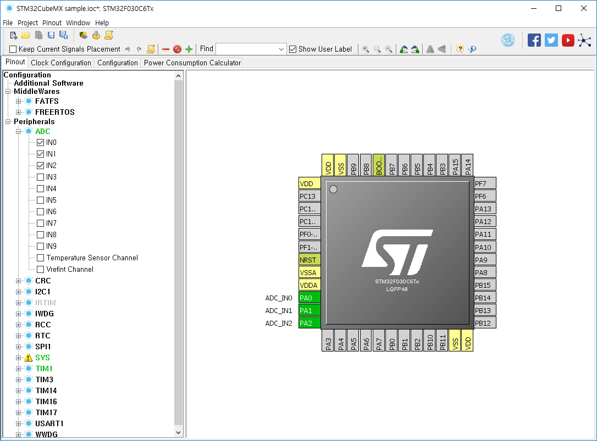
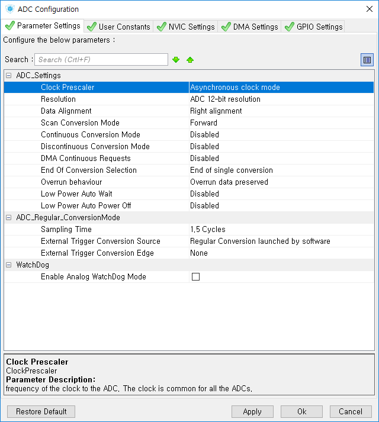
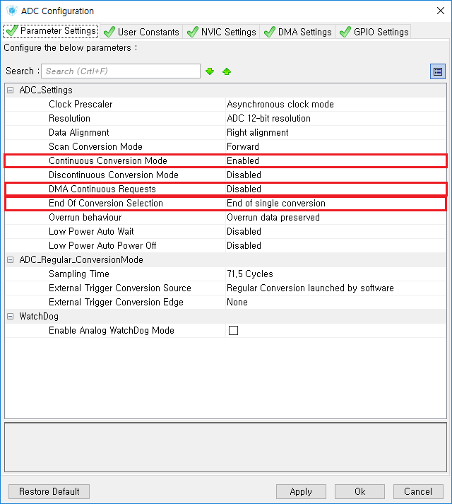
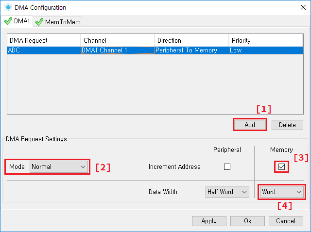

# DMA (Direct Memory Access)를 사용한 ADC
DMA를 사용하여 복수 채널의 ADC read 값을 메모리에 총합시킬 수 있다. CPU 시간을 할애하지 않으면서 단번에 복수의 채널을
읽을 수 있기 때문에 유용하다.

#### 1. CubeMX에서 읽어들일 ADC채널을 선택한다.



#### 2. ADC 상세 설정
Configuration 탭에 "ADC" 버튼을 누르면 ADC 상세 설정 창이 뜬다.



아래 이미지 처럼 설정한다. 중요하면서 자명하지 않은 필드는 하이라이트 해 두었다.



#### 3. DMA 설정
Configuration 탭에 "DMA" 버튼을 누르면 DMA 상세 설정 창이 뜬다.



[1] "Add" 버튼을 누른 후 위의 창처럼 DMA Request, Channel, Direction, 그리고 Priority 필드를 설정한다.

[2] Mode는 Normal과 Circular가 있다. Circular는 목적지 메모리 버퍼가 원형 버퍼<sup>Circular Buffer</sup>임을
의미함으로, 원형 버퍼를 사용하고 싶지 않다면 Normal을 사용한다. Normal은 "일상적인" 메모리 버파다.

[3] Memory 섹션의 Increment를 체크한다. ADC 채널 1개를 읽은 후 메모리 주소 A에다 값을 저장한다고 가정한다면,
다음 ADC 채널을 읽을 때에는 메모리 주소 (A+1)에다가 값을 저장함을 의미한다.

[4] ADC 채널을 읽은 후 메모리를 increment할 때 byte (8 비트), Half Word (16 비트), 아니면 Word (32 비트)씩
increment할 지 설정한다.

#### 4. 코드
````
/* main.c */
#define NUMBER_OF_ADC_CHANNELS   3
uint32_t adc_buffer[NUMBER_OF_ADC_CHANNELS];

int main(void) {
    ...
    /* Start conversion (one-time) */
    HAL_ADC_Start_DMA(&hadc, adc_buffer, NUMBER_OF_ADC_CHANNELS);
    ...
}

void HAL_ADC_ConvCpltCallback(ADC_HandleTypeDef* hadc)
{
   // `adc_buffer` contains ADC read values.
}
````
