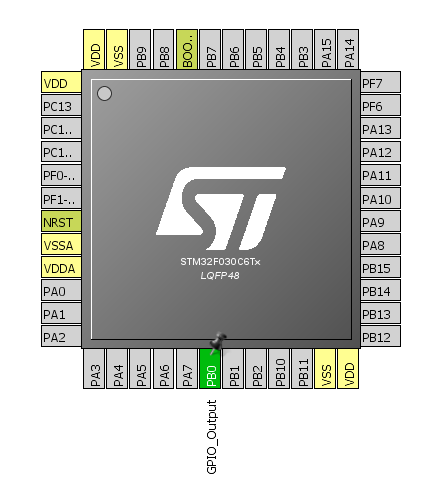
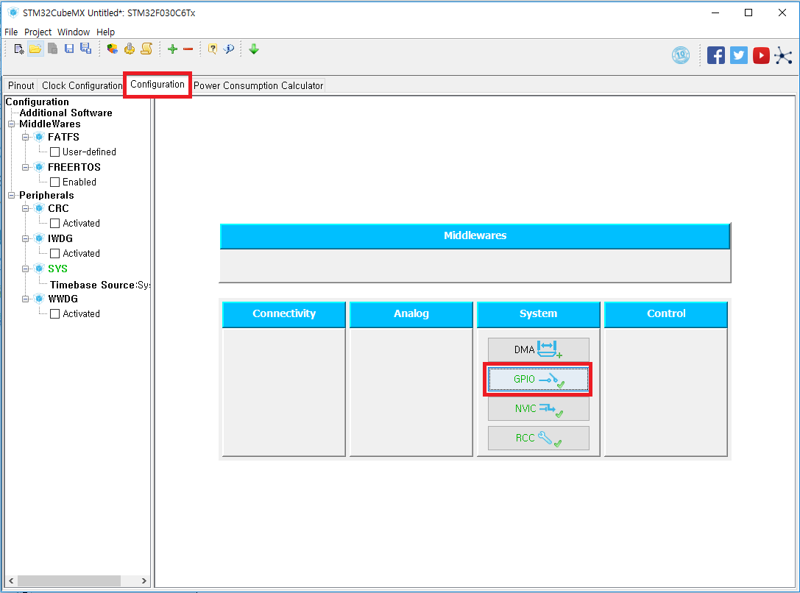
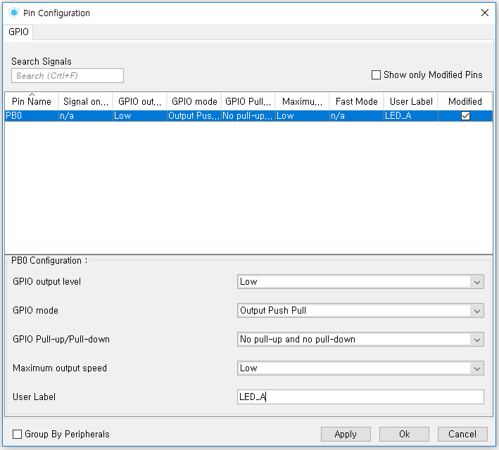
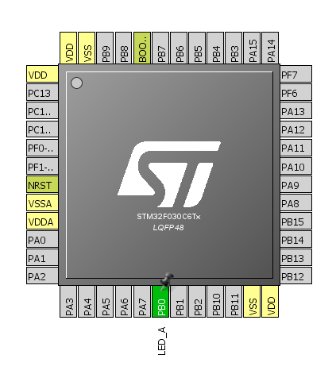

# GPIO

#### 1. STM32 Cube MX 프로젝트에서 원하는 핀을 클릭한 후 “GPIO_Output”을 선택.

#### 2. Configuration 탭의 GPIO 버튼 클릭

#### 3. Pin Configuration 윈도우에서 선택된 GPIO 핀의 상세 설정을 할 수 있다.
이 핀에 User Label "LED_A"를 할당한다.

* GPIO Output Level: 핀의 디폴트 로직 레벨 (High or Low)
* User Label: 핀의 커스텀 라벨. (optional)

#### 4. 핀아웃 뷰
다시 핀아웃 뷰로 돌아가면 해당 핀에 "LED_A" 라벨이 설정된 것을 확인할 수 있다.

#### 5. 코드
CubeMX에서 생성된 코드 내에서 다음 코드로 GPIO를 제어할 수 있다.

LED_A pin HIGH: `HAL_GPIO_WritePin(LED_A_GPIO_Port, LED_A_Pin, GPIO_PIN_SET);`

LED_A pin LOW: `HAL_GPIO_WritePin(LED_A_GPIO_Port, LED_A_Pin, GPIO_PIN_RESET);`

LED_A pin TOGGLE: `HAL_GPIO_TogglePin(LED_A_GPIO_Port, LED_A_Pin);`

User Label 을 사용하지 않고 싶다면, `LED_A_GPIO_Port` 와 `LED_A_Pin` 대신에 
`GPIOB`와 `GPIO_PIN_0`를 사용하면 된다. LED_A 핀이 GPIO PB0 핀이기 때문이다.
