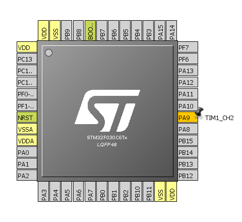
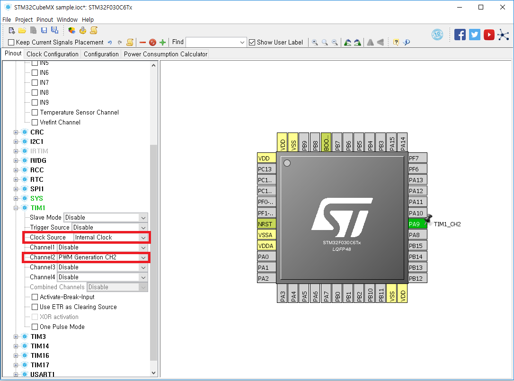
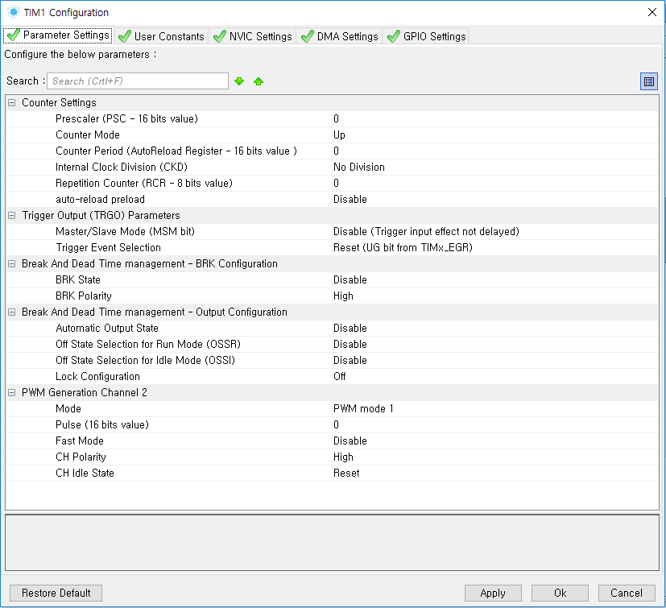

# PWM
STM32F0 MCU의 timer를 사용하여 PWM신호를 출력하고 duty ratio, resolution, 그리고 frequency를 제어한다.

#### 1. PWM 출력을 원하는 핀을 클릭한 후 `TIM1_CH2`를 선택한다.
* `TIM1_CH2`는 "타이머 1, 채널 2"를 의미한다. 아직 timer1이 활성화 되지 않았기 때문에 핀이 노란색이다.



#### 2. Timer 1 Channel 2를 활성화 시키고 PWM모드로 설정한다.



#### 3. PWM 발생 원리
타이머를 설정하기 전에 기본적인 PWM 발생 원리를 알아본다.

클럭 발생원<sup>Clock Source</sup>에서 프리스케일러<sup>Prescaler;분주기分周器</sup>로 클럭 신호가 가면
프리스케일러는 프리스케일러 레지스터의 값에 맞는 클럭 갯수를 "모아서" 카운터 레지스터를 한 번 증분<sup>increment</sup>한다.
즉, 프리스케일러의 값이 N이라면 클럭 신호가 올라갔다 내려가기를 **N번** 반복 한 후에 카운터 레지스터가 **한 번**
증분된다.

이렇게 카운터가 0에서 계속해서 증분하다가 비교 레지스터<sup>Compare Register</sup>의 값과 동일할 때 PWM 출력이 HIGH에서
LOW로 전환한다. 그 후 카운터가 계속 증분하다가 Auto Reload Register의 값과 동일할 때 카운터는 0로 재설정되고 PWM 출력이
LOW에서 HIGH로 전환한다.

#### 4. 타이머 상세 설정
Configuration 탭에 "TIM1" 버튼을 누르면 아래 타이머 상세 설정 창이 뜬다.



이제, 윗단의 "타이머 상세 설정"에서 `Prescaler (PSC - 16 bits value)`와 `Counter Period (AutoReload Register - 16 bits value`
를 어떻게 바꿔야 원하는 주기의 PWM을 만들 수 있는지 알 수 있다.

비교 레지스터<sup>Compare Register</sup>는 코드에서 `__HAL_TIM_SET_COMPARE()` 매크로를 사용해서 바꿀 수 있다.

예: `__HAL_TIM_SET_COMPARE(&htim1, TIM_CHANNEL_2, 100);`

#### 5. 예제
MCU Clock: 8MHz; Prescaler = 8; Auto Reload Register = 1000; Compare Regsiter = 100 이라 가정한다.

프리스케일러가 8이기 때문에 8MHz인 클럭이 1MHz로 "나눠"진다. 즉, 카운터가 1MHz의 속도로 증분된다 (1초에 1,000,000번 증분된다).

카운터가 0일 때 PWM 출력은 HIGH다. 카운터가 1MHz의 속도로 증분되다 100에 도달하면 PWM 출력이 LOW가 된다. 그리고 카운터가
1000에 도달하면 0으로 재설정되고 PWM 출력이 다시 HIGH가 된다. 1번의 PWM duty cycle이 완성되었다.

듀티 비<sup>Duty Ratio</sup>는 10%이며 듀티 사이클 주파수<sup>Duty Cycle Frequency</sup>는 1000Hz 다.

Compare Register가 0일 때는 0% 듀티 비이며 1000일때는 Auto Reload Register와 같아지기 때문에 100% 듀티 비 이다.
따라서 Compare Register의 범위<sup>range</sup>는 0 ~ 1000이다. 따라서 PWM 해상도<sup>PWM Resolution</sup> 역시 1000 이다. 

#### 6. 코드
````
int main(void) {
    ...
    HAL_TIM_Base_Start(&htim1);
    HAL_TIM_PWM_Start(&htim1, TIM_CHANNEL_2); 

    /* The macro __HAL_TIM_SET_COMPARE() sets the PWM duty ratio.
       PWM ratio = n / period
          where 'period' is the value of `htim1.Init.Period` and
          `n` is the 3rd parameter of __HAL_TIM_SET_COMPARE().
   
       `__HAL_TIM_SET_COMPARE` directly modifies the TIMx_CCRx register.
    */
    __HAL_TIM_SET_COMPARE(&htim1, TIM_CHANNEL_2, 100);
    ...
}
````
