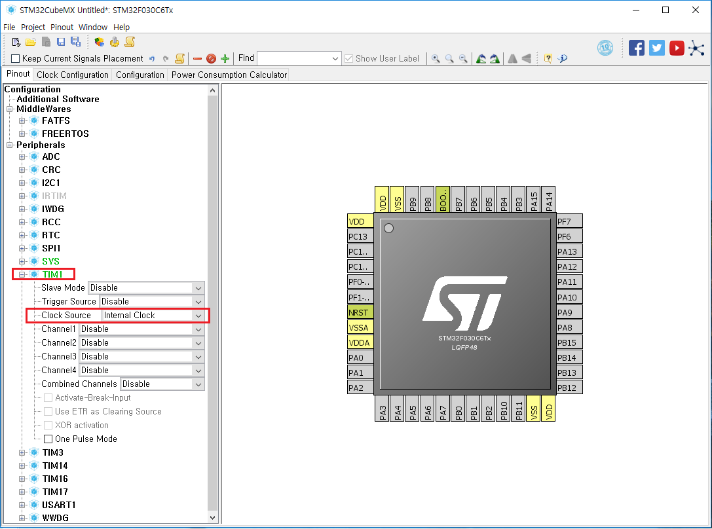
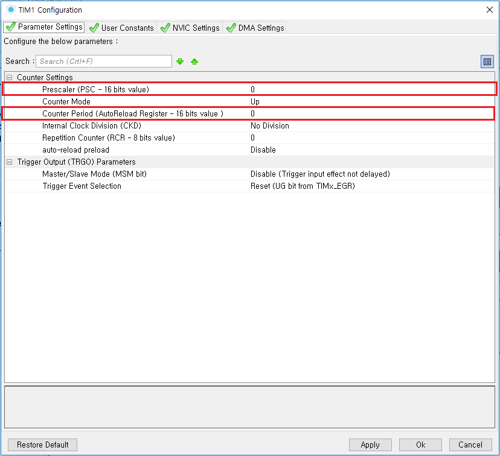
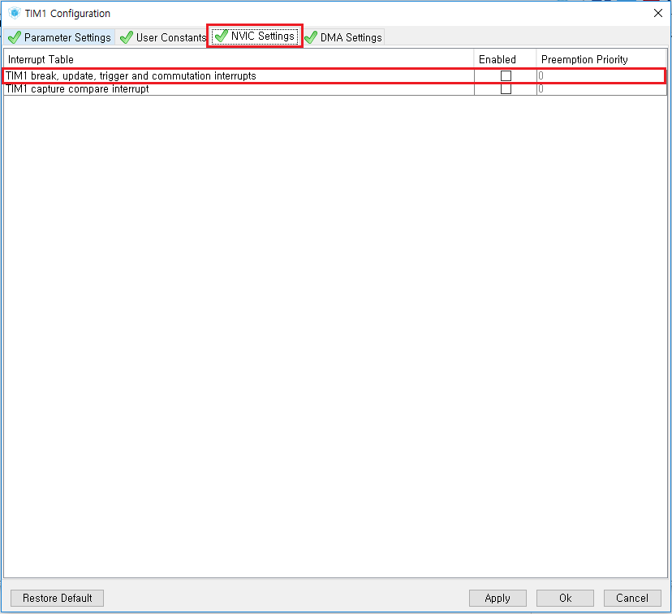

# 타이머 인터럽트
CubeMX의 Configuration 패널에서 타이머와 해당 타이머의 Clock Source를 선택한다. (이번 경우에는 Internal을 선택).

Configuration 탭의 `TIM1` 버튼을 누르면 `TIM1 Configuration` 창이 뜬다.

중요한 필드는 Prescaler (PSC)와 Counter Period (CP)이다.

타이머의 인터럽트가 발생하는 속도는 `MCU_CLOCK_FREQ / (PSC * CP)` 이다.

예를들어서 MCU의 클럭 주파수가 8MHz이고 `(PSC * CP)`가 1000이라면 타이머는 8KHz <==> 1초에 8000번 인터럽트를 발생시킨다.

마지막으로, 인터럽트를 활성화 시킨다. (`TIM1 break, update, trigger, and communication interrupts` 체크박스를 체크한다.)

